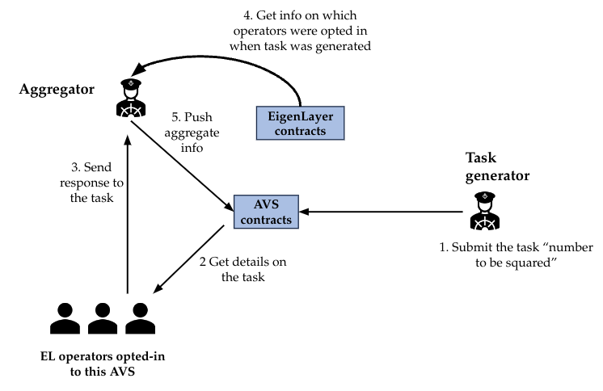

# Aligned Layer 是如何工作的?

[AVS]( https://docs.eigenlayer.xyz/eigenlayer/overview/key-terms) 的架构如下：

我们有：

- [EigenLayer core](https://github.com/Layr-Labs/eigenlayer-contracts/tree/master) 合约.
- AVS 合约:

  - 服务管理器(必须包含惩罚逻辑).
  - 任务管理器(包含任务创建和响应逻辑).
  - [注册合约](https://github.com/Layr-Labs/eigenlayer-middleware) (管理选择加入此 AVS 的运营商).
  
- 任务生成器.
- 聚合器.
- 运营商 (选择加入此AVS的EigenLayer运营商).

这里有一个更详细的关于聚合器和运营商流程的图表:

## Aligned Layer 架构:

- Aligned Layer: 它接收来自不同证明系统的证明，验证它们，将最终结果发送到以太坊，并将数据发布到数据可用性层(A层)

- 数据可用性层(DA): 为不同的证明提供存储空间.
  
- 通用证明者/验证者：每隔几天，从 DA 层取出证明，并生成一个包含对所有证明的验证的证明。通用证明者可以基于 SP1、Risc0 或 Nexus 虚拟机，这是一种能够证明通用 Rust 代码的虚拟机。使用相应的 Rust 验证代码完成证明的验证。验证可以使用树结构完成。
  
- 以太坊：信任和流动性的来源.

### 主要组件间的交互:

1. Aligned Layer 从不同的来源接收几个证明，这些证明可能使用不同的证明系统生成。这些证明具有不同的证明大小、验证时间和不同的验证逻辑。然而，所有证明都有一个共同的特点：它们的验证速度很快。

2. Aligned Layer 拥有专用的验证器，可以用来检查每个证明的有效性并将结果发布到以太坊。证明存储在数据可用性层中，这一层提供了成本效益高的存储策略。Aligned 中的运营商从这一层获取证明数据.

3. 以太坊接收来自 Aligned Layer 的验证结果。然而，以太坊本身无法访问验证证明，因为这将成本过高。相反，一个通用 Rust 证明者会为给定周期内包含的所有证明生成验证证明（见图4）

4. 为了聚合所有证明，在第一步，所有证明都转换为虚拟机执行的证明，实现证明的统一(见图4)。然后，我们可以通过递归证明对证明的验证来缩小证明大小，如树状图所示(见图 5）

