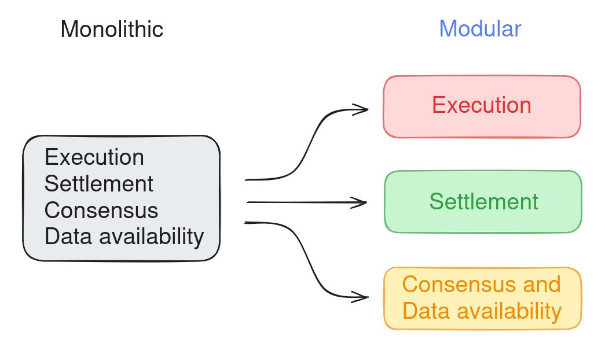
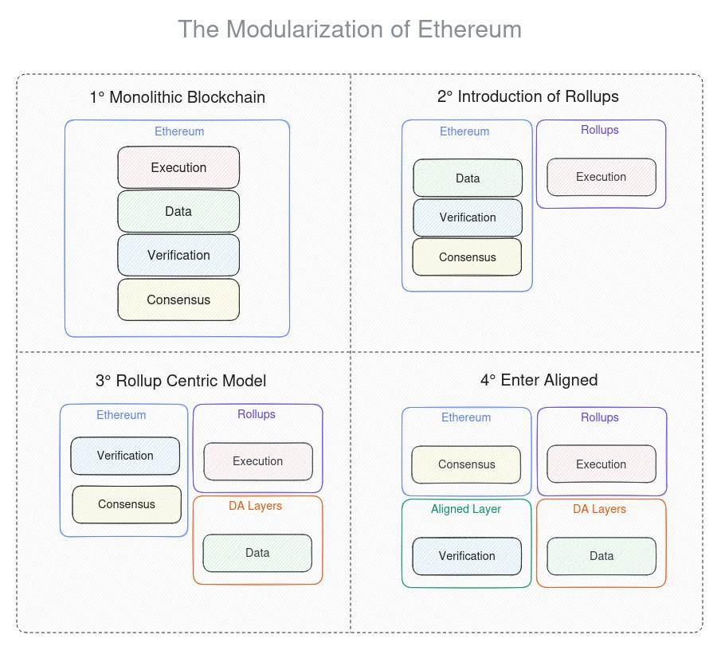
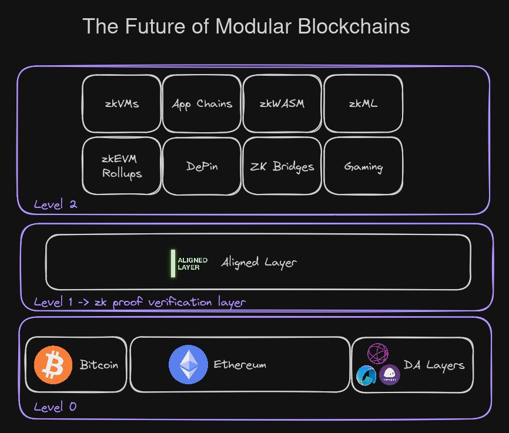

以太坊的模块化

# 模块化方法

如 EigenLayer 论文中所述：

“以太坊开创了模块化区块链的概念，其中分布式应用程序(DApps)成为可以在以太坊信任网络上无需许可地构建的模块”

在这种背景下，模块化的概念与构建区块链的初步方法——单体方法形成对比，在单体方法中，单个区块链负责执行所有任务，如处理交易、检查准确性以及使节点就其达成一致。这种工作方法在扩展时会引发一些固有问题，导致昂贵的硬件、有限的控制和高昂的开销。

通过向区块链引入模块化，它使得其过程可以在多个专用层之间分开。这种方法已被用来创建像 rollups 这样的网络，rollups 是一种扩展解决方案，它在其他层上处理交易，然后将它们批量‘rolls’以包含在主区块链上。这有助于减轻主区块链的压力，从而实现更快和更经济的交易，同时确保主 L1 链的安全性保持完好无损。

可以在这里看到差异：

在我们的案例中，有了 Aligned Layer 的加入，我们正在解决一个简单的问题：ZK 的验证。EVM 并非为此设计。因此，我们正在创建另一个专门用于验证在 EVM 外工作的任何证明系统的层，使用以太坊的共识机制来确保安全。

整个模块化以太坊方案将如下:

## 与其他区块链的互动.

Aligned Layer 可能在以太坊之外有更多应用，并帮助其他区块链验证证明。

建议的未来方案如下工作：

如图所示，在第0层是比特币、以太坊和 DA 层，Aligned Layer 将作为验证层位于第1层，第2层是其他层，如：AppChains、zkMLs、zkEVM Rollups等。

