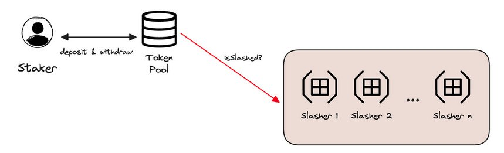

# EigenLayer的作用.

## 什么是 EigenLayer？
EigenLayer是建立在以太坊之上的一套智能合约，引入了再质押机制，它使得以太坊共识层上的ETH可以用于验证建立在以太坊生态系统之上的新软件模块。通过这种方式，以太坊质押者可以通过提供集合安全来帮助确保多个服务的安全，这种集合安全是当多方合并他们的资源以为系统提供加强的安全时发生的。

如果你打算在以太坊上建立一个去中心化的基础设施，确保其经济安全至关重要。然而，存在一个问题：以太坊的设计限制了可以创建的内容类型。

为了克服这些限制，你可以：

 
1.	创建另一个没有以太坊限制的层.
2.	并以某种方式确保其安全.

这就是我们创建 Aligned Layer 的原因：一个由以太坊质押者的集合安全保障的验证.

## 关于惩罚机制

加密经济安全量化了某人必须承担的成本，以使协议失去所需的安全属性。这被称为腐败成本（Cost-of-Corruption, CoC），如果与腐败相关的费用大于任何可能的收益，系统被视为具有强大的安全性。

EigenLayer 通过施加重大成本的惩罚机制来确保加密经济安全。本质上，惩罚可以被视为一种经济处罚；可以被认为是烧毁代币。

由于 EigenLayer 智能合约持有以太坊 PoS 质押者的提取凭证，任何在 AVS 参与过程中的对抗行为都将导致质押者的 ETH 被削减。

质押者的承诺和质押的执行发生在以太坊平台上，因此惩罚机制也通过以太坊上的智能合约执行。如果质押者违反承诺，任何人都可以向惩罚合约提供证据，从而导致不诚实质押者的质押被没收。

EigenLayer 需要一个无需信任且可编程的平台来执行不同质押者的承诺，以太坊是最合适的。它持有最大的质押。质押的金额越高，它为用户提供的安全性和保障就越多。

目标是让质押者能够提供安全性，赋予他们有效保障一系列基础设施协议的安全的能力。如果质押者试图从事欺诈活动，任何人都可以提供证据来惩罚质押者，这是我们在 Aligned Layer 中使用的方法。

